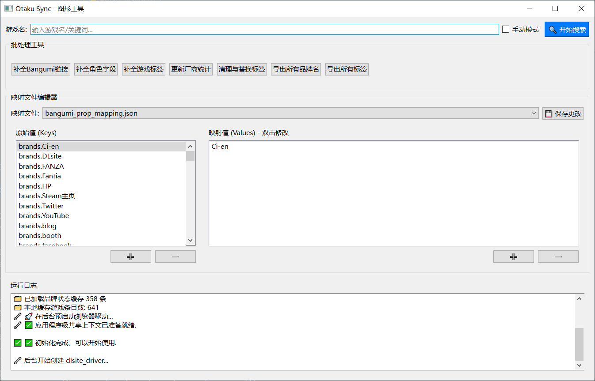
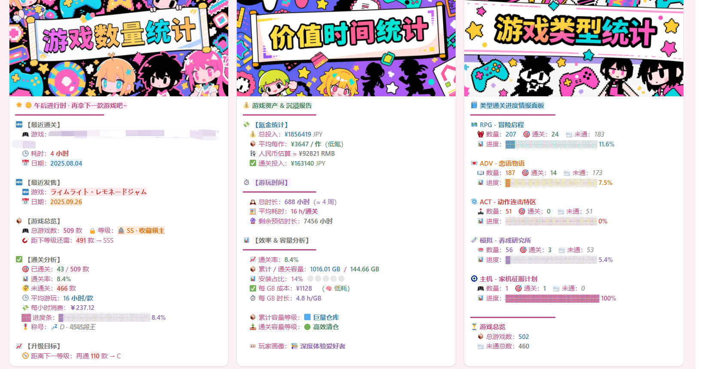

<div align="center">
  <br>
  <h2 align="center">Otaku-Sync</h2>
  <p align="center">
    一款能自动同步 Galgame 游戏信息到 Notion 数据库的高效工具
  </p>
  <p align="center">
    <a href="https://github.com/baiheyyds/Otaku-Sync/actions">
      
    </a>
    <a href="./LICENSE">
    
    </a>
    
    
    
  </p>
</div>

---

**Otaku-Sync** 是一个为 Galgame 和同人游戏爱好者打造的自动化信息管理解决方案。它能够从 **DLsite**, **Fanza**, **GGBases**, 以及 **Bangumi** 等主流平台抓取丰富的数据，并将其智能、规范地同步到你的个人 Notion 数据库中。

与繁琐的手动录入说再见。现在，你可以通过一个现代化的图形界面，轻松管理你的游戏收藏，并借助其强大的数据整合与映射能力，确保你的数据库信息高度统一和规范。



## ✨ 项目特性

-  **优雅的图形用户界面 (GUI)**: 提供一个现代化、直观的图形界面，让搜索、选择、同步的全过程一目了然。所有交互（如处理重复项、翻译新标签）都在可视化的对话框中完成，操作体验流畅。
-  **双模式操作：GUI 与 CLI**:
   -  **GUI 模式 (推荐)**: 为绝大多数用户提供开箱即用的图形化体验。
   -  **CLI 模式**: 保留了功能完整的命令行界面，适合高级用户或自动化脚本集成。
-  **多源数据聚合**: 同时从 DLsite, Fanza, GGBases, Bangumi 等多个权威平台获取游戏、品牌和角色信息。
-  **全周期信息同步**: 覆盖从游戏基本信息、发售日期、价格，到剧本、原画、声优、标签等全方位数据。
-  **智能数据处理**:
   -  **重复检测**: 在添加新游戏前进行智能相似度比对，并让你在GUI中轻松选择“更新现有条目”或“创建新条目”。
   -  **品牌归一**: 自动将不同平台的同一品牌（如「ゆずソフト」和「YUZUSOFT」）映射为统一记录。
   -  **标签映射**: 交互式地翻译日文标签，并将同义标签（如「NTR」和「寝取られ」）进行归类合并，所有操作均有GUI支持。
-  **角色信息关联**: 自动从 Bangumi 抓取游戏关联的角色、声优等信息，并建立关系链接。
-  **高度可定制**: 通过独立的映射文件和配置文件，你可以轻松自定义 Notion 字段、标签体系和品牌别名。
-  **高效稳定**: 采用异步 IO 和共享浏览器驱动等技术，显著提升抓取效率，节约系统资源。



## 🎮 如何使用

一切准备就绪后，你可以选择以下任一方式运行程序。

### 方式一：使用图形界面 (推荐)

在项目根目录运行 `gui_app.py` 启动图形化工具：

```bash
python gui_app.py
```

**使用流程:**
1.  在顶部的输入框中输入游戏关键词，然后点击“开始同步”按钮。
2.  程序会自动在后台搜索，并在下方的日志区域显示进度。
3.  当需要你进行选择时（例如，从多个搜索结果中选择一个，或处理一个重复游戏），程序会自动弹出对话框，引导你完成操作。
4.  同步完成后，结果会清晰地显示在日志中。

### 方式二：使用命令行

如果你偏爱命令行，可以运行 `main.py`：

```bash
python main.py
```

程序启动后，会提示你输入游戏关键词。

-  **普通模式**: 直接输入游戏名（日文或中文）并回车。
-  **手动模式**: 在关键词后追加 ` -m`，这会在需要时让你手动选择，而不是自动选择最优结果。
-  **退出**: 输入 `q` 或直接按 Ctrl+C。

## 🏗️ 技术架构

本项目最近经历了一次重大的架构重构，引入了 **交互提供者 (Interaction Provider)** 设计模式，将核心业务逻辑与用户界面完全解耦。

-   **核心逻辑 (`core/`)**: 包含所有的数据抓取、处理和同步逻辑。这些模块是纯粹的业务层，不依赖于任何特定的UI实现。
-   **交互提供者 (`core/interaction.py`)**: 定义了一个抽象接口，用于处理所有需要用户输入的场景（例如，选择、确认、文本输入）。
-   **UI 实现**:
    -   **GUI (`gui_app.py`, `utils/gui_bridge.py`)**: `GuiInteractionProvider` 实现了交互接口，通过 Qt 信号和槽机制将后台逻辑的请求转化为图形化的对话框。
    -   **CLI (`main.py`)**: 命令行界面通过一个简单的 `CliInteractionProvider` 实现，将交互请求转化为控制台的 `input()` 提示。

这种架构使得项目具有极高的可维护性和可扩展性。未来可以轻松地为其添加新的前端，例如 Web 界面，而无需改动任何核心业务代码。

## 📂 项目结构

```
Otaku-Sync/
├── clients/              # 各平台（DLsite, Fanza等）的抓取客户端
├── config/               # 项目配置（Notion字段、API Token等）
├── core/                 # 核心业务逻辑
│   ├── interaction.py    # 交互提供者抽象接口
│   └── ...
├── mapping/              # 品牌、标签等映射文件（可自定义）
├── utils/                # 通用工具（日志、驱动、GUI桥接等）
├── .env.example          # 环境变量模板
├── gui_app.py            # 🚀 图形界面 (GUI) 程序入口
├── main.py               # ⌨️ 命令行 (CLI) 程序入口
└── requirements.txt      # Python 依赖库
```

## 🚀 快速开始 (环境配置)

*首次使用需要进行一些初始配置，无论你使用GUI还是CLI。*

### 1. 环境准备

-  **Python**: 推荐版本 `3.8` 或更高。
-  **Google Chrome**: 请确保你的电脑上已安装最新版的 Chrome 浏览器。

### 2. 下载与安装

克隆本项目，进入目录，并安装所有依赖：

```bash
git clone https://github.com/baiheyyds/Otaku-Sync.git
cd Otaku-Sync
pip install -r requirements.txt
```

### 3. Notion 数据库准备 (关键步骤)

#### ① 创建数据库
在你的 Notion 中创建 **3 个** 新的数据库，分别用于存储游戏、品牌和角色信息。

#### ② 获取 Notion API Token
1. 访问 [Notion 集成页面](https://www.notion.so/my-integrations)。
2. 创建一个新的集成，并复制生成的 **"Internal Integration Token"** (`secret_...`)。

#### ③ 关联数据库与集成
回到你创建的每一个数据库，点击右上角的 `...` 菜单，选择 **"Add connections"**，然后选择你刚刚创建的集成。**每个数据库都需要执行此操作**。

#### ④ 获取数据库 ID
在浏览器中打开你的每个数据库页面，从 URL 中复制 32 位的数据库 ID。
`https://www.notion.so/你的工作区/THIS_IS_YOUR_DATABASE_ID?v=...`

### 4. 配置项目
1. 在项目根目录，复制 `.env.example` 并重命名为 `.env`。
2. 打开 `.env` 文件，填入你的 **Notion Token** 和三个 **数据库ID**。如果需要 Bangumi 功能，也请填入 **Bangumi Token**。

   ```ini
   # .env
   NOTION_TOKEN="secret_xxxxxxxx"
   GAME_DB_ID="你的游戏数据库ID"
   BRAND_DB_ID="你的厂商数据库ID"
   CHARACTER_DB_ID="你的角色数据库ID"
   BANGUMI_TOKEN="你的Bangumi API Token"
   ```
   > ⚠️ **安全警告**: `.env` 文件包含了你的私密信息，已被添加到 `.gitignore` 中。**绝对不要**将此文件上传到任何公共仓库！

### 5. 配置 Notion 字段 (必读)
为了让程序能正确写入数据，你的 Notion 数据库需要包含特定的字段。请严格按照下表创建或修改你的数据库属性。

<details>
<summary><b>展开查看 ✅ 游戏数据库 字段要求</b></summary>

| 字段名称 (需与 `config_fields.py` 保持一致) | 类型 (Type)              | 说明                       |
| :------------------------------------------ | :----------------------- | :------------------------- |
| `游戏名称`                                  | **标题 (Title)**         | **必需**，游戏主标题       |
| `游戏别名`                                  | 文本 (Rich Text)         | 游戏的其他常用名           |
| `游戏简介`                                  | 文本 (Rich Text)         | 游戏的故事梗概             |
| `游戏官网`                                  | 网址 (URL)               | 游戏的官方网站             |
| `DLsite链接`                                | 网址 (URL)               |                            |
| `Fanza链接`                                 | 网址 (URL)               |                            |
| `游戏大小`                                  | 文本 (Rich Text)         | 如 `1.2GB`                 |
| `发售时间`                                  | **日期 (Date)**          |                            |
| `剧本`                                      | **多选 (Multi-select)**  |                            |
| `原画`                                      | **多选 (Multi-select)**  |                            |
| `声优`                                      | **多选 (Multi-select)**  |                            |
| `音乐`                                      | **多选 (Multi-select)**  |                            |
| `标签`                                      | **多选 (Multi-select)**  |                            |
| `价格`                                      | **数字 (Number)**        |                            |
| `游戏封面`                                  | **文件 (Files & media)** |                            |
| `游戏厂商`                                  | **关系 (Relation)**      | **必需**，关联到品牌数据库 |
| `GGBases资源`                               | 网址 (URL)               |                            |
| `游戏类别`                                  | **多选 (Multi-select)**  | 如 `RPG`, `ADV`            |
| `Bangumi链接`                               | 网址 (URL)               |                            |
| `游戏角色`                                  | **关系 (Relation)**      | **必需**，关联到角色数据库 |

</details>

<details>
<summary><b>展开查看 ✅ 品牌数据库 字段要求</b></summary>

| 字段名称 (需与 `config_fields.py` 保持一致) | 类型 (Type)              | 说明                 |
| :------------------------------------------ | :----------------------- | :------------------- |
| `厂商名`                                    | **标题 (Title)**         | **必需**，品牌主名称 |
| `官网`                                      | 网址 (URL)               |                      |
| `图标`                                      | **文件 (Files & media)** | 品牌 Logo            |
| `别名`                                      | 文本 (Rich Text)         |                      |
| `简介`                                      | 文本 (Rich Text)         |                      |
| `Ci-en`                                     | 网址 (URL)               |                      |
| `Twitter`                                   | 网址 (URL)               |                      |
| `生日`                                      | 文本 (Rich Text)         |                      |
| `bangumi链接`                               | 网址 (URL)               |                      |
| `公司地址`                                  | 文本 (Rich Text)         |                      |

</details>

<details>
<summary><b>展开查看 ✅ 角色数据库 字段要求</b></summary>

| 字段名称 (需与 `config_fields.py` 保持一致) | 类型 (Type)              | 说明                 |
| :------------------------------------------ | :----------------------- | :------------------- |
| `角色名称`                                  | **标题 (Title)**         | **必需**，角色主名称 |
| `别名`                                      | 文本 (Rich Text)         |                      |
| `声优`                                      | 文本 (Rich Text)         |                      |
| `性别`                                      | **单选 (Select)**        |                      |
| `头像`                                      | **文件 (Files & media)** |                      |
| `BWH`                                       | 文本 (Rich Text)         | 三围                 |
| `身高`                                      | 文本 (Rich Text)         |                      |
| `简介`                                      | 文本 (Rich Text)         |                      |
| `详情页面`                                  | 网址 (URL)               |                      |
| `生日`                                      | 文本 (Rich Text)         |                      |
| `血型`                                      | **单选 (Select)**        |                      |

</details>

> 💡 **提示**: 如果你想修改 Notion 中的字段名，请务必同步修改 `config/config_fields.py` 文件中对应的字符串。

## 🔧 核心概念与维护

### 映射系统 (`mapping/` 目录)
这是 Otaku-Sync 的灵魂。通过维护该目录下的 JSON 文件，你可以实现高度自动化的数据整理。

-  `brand_mapping.json`: **品牌归一**。将不同写法（如 `YUZUSOFT` 和 `ゆずソフト`）映射到同一个品牌记录。
-  `tag_jp_to_cn.json` / `tag_fanza_to_cn.json`: **日文标签翻译**。当程序通过 GUI 或 CLI 询问你新标签的翻译时，你的选择会自动保存到这里。
-  `tag_mapping_dict.json`: **标签同义词合并**。将多个相似标签（如 `巨乳`, `爆乳`）归类到一个主标签下。

**维护建议**:
-  **即时维护**: 使用 GUI 时，程序会实时引导你完成翻译和映射，大大减轻了手动维护负担。
-  **备份**: `mapping/` 目录是你个性化配置的核心，建议定期备份。

## 🤝 贡献

欢迎任何形式的贡献！

-  如果你发现了 Bug，请在 [Issues](https://github.com/baiheyyds/Otaku-Sync/issues) 中提交详细报告。
-  如果你有新功能或改进建议，也欢迎提出 Issue 或提交 Pull Request。

## 📜 授权协议 (License)

本项目基于 [GNU GPL v3](./LICENSE) 许可证进行分发和使用。

## ⚠️ 免责声明

-  本项目仅供个人学习、技术研究和数据归档使用。请在遵守当地法律法规的前提下使用本工具。
-  项目抓取的部分内容可能包含 **NSFW** 元素，请谨慎使用。
-  请妥善保管你的 `.env` 文件和 Notion Token，切勿泄露。
